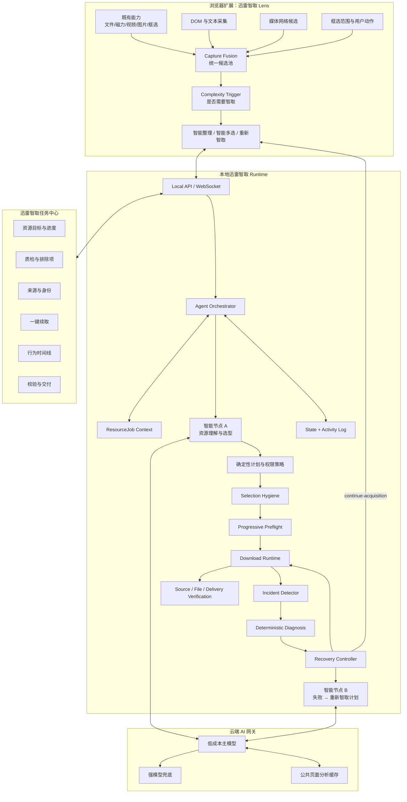
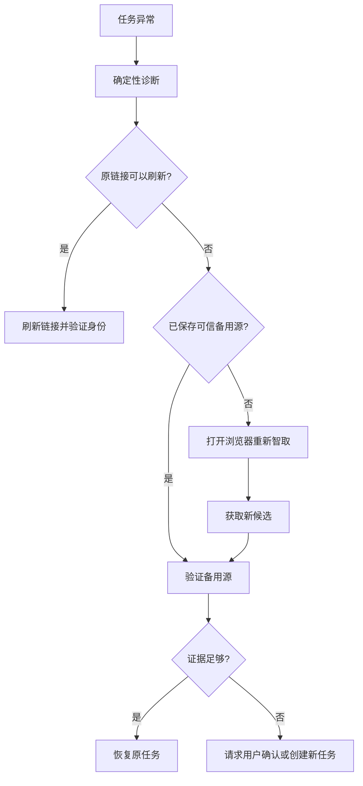
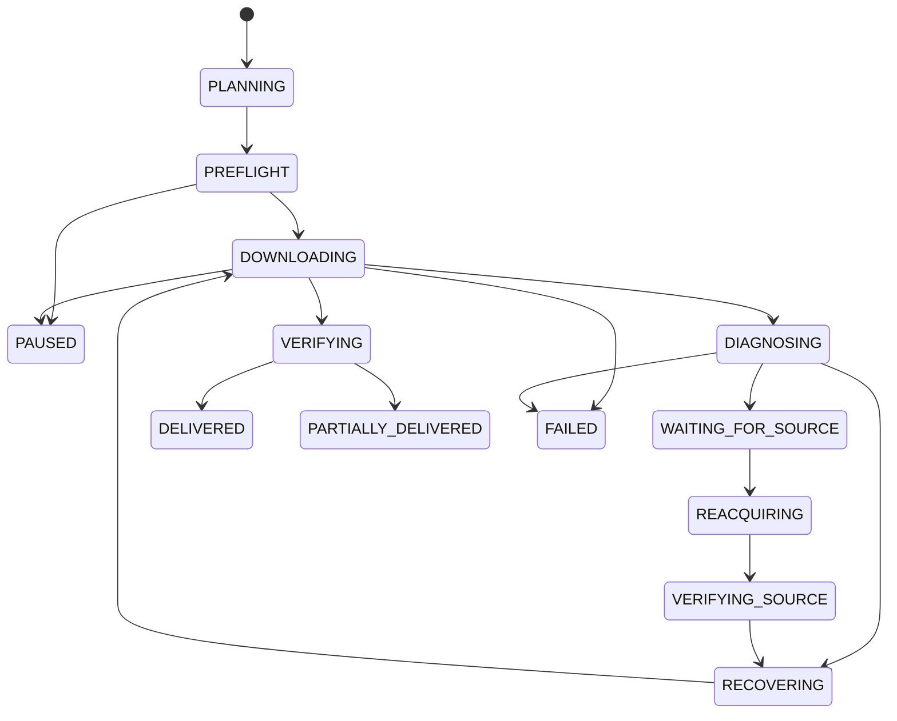

# 迅雷智取：闭环资源交付 Agent 开发者决策蓝图

> **产品名**：迅雷智取  
> **技术定义**：单编排器、双智能节点、确定性执行的闭环资源交付 Agent  
> **文档版本**：v0.4 开发者决策版（节点 A 与 AI 接入修订）  
> **适用场景**：双人协作开发、技术决策、快速原型推进、联调与 Demo 实施；不作为最终参赛提交文案  
> **本次修订重点**：在 v0.3 开发者决策版基础上，仅修订智能节点 A 的产品与技术定义，并补充浏览器扩展接入 AI、API Key 管理、模型网关、调用成本控制和用户额度分层；其余产品结构、协作方式与开发原则保持不变。

> **开发者说明**：本文件保留产品与技术全貌，但新增内容以“尽快做出真实、可观察、可迭代的产品”为首要原则。本文不要求在编码前冻结全部 Schema、关系枚举、算法阈值与评估体系；只冻结会阻塞双人协作的最小接口语义，其他决策以真实页面、真实交互和真实下载反馈快速修正。

---

# 0. 文档结论摘要

“迅雷智取”不是一个通用聊天助手，也不是一个重新实现批量下载、图片下载或视频嗅探的浏览器插件。

迅雷现有浏览器扩展已经具备：

- 普通文件链接接管；
- Magnet 等明显资源识别；
- 视频资源嗅探、下载与投屏入口；
- 批量图片提取与格式、尺寸筛选；
- 鼠标框选、多链接批量下载；
- 拉起迅雷客户端创建下载任务；
- 丰富的文件类型接管规则。

本项目不应把上述能力包装成“AI 创新”。本次实测真正暴露的空白是：

1. 视频、普通链接、Magnet、图片、框选结果彼此割裂，没有形成统一候选资源池；
2. 框选以后直接把大量链接交给客户端，缺少理解、过滤、分组与确认；
3. `index.html`、0 B 地址、导航链接、推荐文章等噪声容易混入下载任务；
4. 客户端只收到 URL 或文件列表，浏览器中的页面语义、版本说明、备用来源和用户意图全部丢失；
5. 任务失败后，用户仍需手工回到浏览器重新搜索、重新复制、重新创建任务；
6. 当前产品管理的是链接和下载任务，而不是用户希望最终获得的“资源目标”。

因此，迅雷智取的核心价值调整为：

> **复用迅雷已有资源嗅探和下载执行能力，在其上增加“候选融合—语义理解—智能筛选—上下文携带—可靠托管—失败续取—最终验证”的闭环资源交付层。**

完整闭环：

```text
已有嗅探 / 用户框选
→ 多通道候选融合
→ 智能节点 A：资源理解与选型
→ 确定性筛选与渐进式质检
→ 创建 ResourceJob
→ 持续下载与状态观测
→ 故障检测与确定性诊断
→ 一键续取
→ 智能节点 B：失败上下文到重新获取计划
→ 浏览器重新智取
→ 新来源身份验证
→ 恢复原任务
→ 校验与交付
```

最终可运行产品仍由三层组成：

1. **浏览器扩展：迅雷智取 Lens**
   - 复用现有下载支持扩展的交互基础；
   - 汇聚多通道候选；
   - 提供“快捷下载、智能整理、智能多选、重新智取”四种模式；
   - 展示轻量资源计划并承接失败后的重新获取。

2. **本地运行服务：迅雷智取 Runtime**
   - Agent 本体；
   - 持久任务上下文；
   - 状态机与轻量事件日志；
   - 资源图、计划引擎、质检、下载、诊断、恢复、校验；
   - 模型路由与权限策略。

3. **网页版任务中心：迅雷智取任务中心**
   - 高保真模拟迅雷 17 的 AI 资源任务模块；
   - 展示资源目标、下载进度、质检、来源、恢复和交付；
   - 承担高风险动作审批和“一键续取”入口。

比赛演示还需要一个**受控资源页与故障环境**，但它不是产品本体。

---

# 1. 本次实测结论与现有能力基线

## 1.1 已验证的现有浏览器扩展能力

根据实际体验，现有“迅雷下载支持”扩展至少包含以下能力：

### 资源检测

- 对明显 MP4、M3U8 等在线视频资源进行检测；
- 对明显 Magnet 或资源地址进行检测；
- 在页面左下角显示发现资源数量；
- 展开后可查看资源并执行下载；
- 视频场景提供“下载”和“投屏”。

### 快捷入口

- 右上角扩展菜单；
- 打开迅雷；
- 批量图片下载；
- 多选下载；
- 高级设置；
- 暂停全部接管。

### 多选下载

- 通过快捷键或右键菜单进入多选模式；
- 点击超链接进行选择；
- 拖拽形成矩形范围，识别范围内链接和部分纯文本链接；
- 按回车后直接拉起迅雷客户端；
- 支持反向选择。

### 批量图片下载

- 新标签页展示当前页面图片；
- 按 JPEG、PNG、GIF、其他分类；
- 通过宽高条件筛选；
- 批量选择与下载。

### 客户端接管

- 将选中链接发送至迅雷；
- 客户端弹出“新建任务”窗口；
- 显示任务文件列表；
- 允许选择本地或云盘等下载位置。

这些能力是本项目的**既有基础设施**，不应重新实现为创新卖点。

## 1.2 实测暴露的问题

### 问题 A：采集通道割裂

视频浮层已经知道页面存在媒体资源，但多选框选播放器区域后，视频资源未必进入选中结果。

这说明不同模块可能各自维护：

- DOM 超链接；
- 网络嗅探媒体；
- 图片资源；
- Magnet；
- 框选范围；
- 纯文本链接。

它们没有进入统一的数据层。

### 问题 B：框选后缺少理解与确认

当前多选模式：

```text
拖拽框选
→ 直接按回车
→ 客户端创建任务
```

中间没有：

- 候选预览；
- 噪声排除；
- 版本识别；
- 主文件与附件分组；
- 镜像合并；
- 与设备环境匹配；
- 用户目标确认。

### 问题 C：噪声链接大量进入客户端

实测中，框选后任务列表可混入大量：

- `index.html`；
- 0 B 链接；
- 页面导航；
- 相关文章；
- 同页跳转；
- 重复入口。

这说明现有逻辑偏向“尽可能多抓”，而不是“理解用户想要什么”。

### 问题 D：浏览器上下文丢失

插件向客户端传递 URL，但通常不携带：

- 原始页面；
- 页面标题；
- 链接附近说明；
- 用户框选范围；
- 哪些候选互为备用来源；
- 用户排除了什么；
- AI 为什么选中某项；
- 失败后应回到哪个页面。

### 问题 E：失败后流程断裂

当前产品链路基本是单向的：

```text
浏览器 → 迅雷客户端
```

任务失败后，浏览器与客户端之间没有闭环，用户需要手动重新查找来源。

---

# 2. 产品机会重新定义

## 2.1 不再竞争“抓到更多链接”

DownThemAll、迅雷下载支持及大量下载扩展已经能完成：

- 链接发现；
- 文件类型筛选；
- 批量选择；
- 图片抓取；
- 批量排队；
- 调用下载器。

迅雷智取的差异化应明确为：

> **现有扩展负责发现候选；迅雷智取负责理解候选、整理目标、避免误选、持续托管和失败续取。**

## 2.2 从 URL 到 ResourceJob

URL 只是来源，用户真正想完成的是：

```text
获得适合当前设备的正确版本
+ 必要附件
+ 可用来源
+ 失败恢复策略
+ 最终校验和落地
```

因此核心业务对象不是 URL，而是：

```text
ResourceJob
├── ResourceIntent
├── ResourceIdentity
├── SelectedAssets
├── AlternativeSources
├── AcquisitionContext
├── DeliveryPolicy
├── ExecutionState
├── RecoveryContext
└── CompletionCriteria
```

## 2.3 新的核心用户价值

### 选对

- 从复杂候选中选择正确版本；
- 区分平台、架构、语言、清晰度和附件；
- 排除导航、广告、重复和无关项目。

### 下稳

- 下载前做无感质检；
- 保存备用来源和恢复证据；
- 监控下载过程。

### 救回

- 失败后不只显示错误；
- 一键刷新原链接；
- 使用原页面备用源；
- 携带原任务目标返回浏览器重新智取；
- 验证新来源后恢复原任务。

### 验证

- 哈希；
- 文件结构；
- 分卷完整性；
- 压缩包可读性；
- 最终目录和附件完成度。

---

# 3. 产品定义

## 3.1 产品名

# 迅雷智取

用户侧文案：

> **看懂资源，选对文件，失败续取，托管到完成。**

技术侧定义：

> **单编排器、双智能节点、确定性执行的闭环资源交付 Agent。**

## 3.2 为什么可以称为 Agent

Agent 不等于聊天框，也不等于简单调用下载接口。

迅雷智取具备：

### 明确目标

```text
将用户需要的正确资源可靠地交付到本地。
```

### 持久上下文

- 页面与框选上下文；
- 候选资源及发现通道；
- 设备环境和用户偏好；
- 资源图和资源身份；
- 当前来源与备用来源；
- 下载进度和已下载块；
- 故障证据；
- 已执行动作；
- 用户批准记录；
- 最终完成条件。

### 工具集合

- DOM 与文本采集；
- 网络媒体候选读取；
- Magnet 和 Torrent 解析；
- URL 探测；
- 下载控制；
- 磁盘检查；
- 哈希验证；
- 候选来源验证；
- 浏览器重新获取；
- 文件交付。

### 反馈循环

```text
观察
→ 规划
→ 执行
→ 获取反馈
→ 重新规划
→ 验证
```

### 受约束自主性

- 低风险、证据充分的操作可自动执行；
- 高风险或缺乏证据的操作必须询问；
- 模型不能直接修改任务状态或文件系统。

---

# 4. Agent 在系统中的定位

## 4.1 Agent 本体不在浏览器扩展

浏览器扩展是：

- 感知入口；
- 用户意图入口；
- 候选采集工具；
- 重新智取工具；
- 轻量确认界面。

任务中心是：

- 状态可观测界面；
- 人类审批界面；
- 恢复和交付界面。

真正的 Agent 本体位于 Runtime：

```text
ResourceDeliveryAgent
├── AgentOrchestrator
├── TaskContext
├── ToolRegistry
├── PolicyEngine
├── StateMachine
├── ModelRouter
├── CaptureFusionSkill
├── ResourcePlanningSkill
├── PreflightSkill
├── DownloadControlSkill
├── DiagnosisSkill
├── RecoverySkill
└── VerificationSkill
```

## 4.2 为什么不是多 Agent

本项目虽然有多个能力模块，但它们：

- 共享同一个 ResourceJob；
- 共享同一个任务上下文；
- 共享状态机和权限体系；
- 由同一个编排器调度；
- 通常复用同一主模型。

因此不应为了概念包装成“多个 Agent 相互协商”。

准确表述为：

> 一个闭环资源交付 Agent，包含两个真正需要 LLM 的智能节点和多项确定性技能。

---

# 5. 双智能节点重新定义

## 5.1 智能节点 A：资源理解与选型

旧定义：

```text
页面 → 资源计划
```

实测与讨论后的正式定义：

```text
多通道候选资源
+ 页面标题、章节和候选周边说明
+ 工程探测得到的技术元数据
+ 用户主动框选、点击或修改的显式条件
+ 当前设备的客观兼容信息
→ 资源概览、版本解释、场景化选型与可确认的 ResourcePlan
```

节点 A **不猜测用户隐藏的心理意图**，也不把“当前设备”误当成用户唯一目的。它负责把页面中的专业文件名、版本差异、平台条件、附件关系和质量规格翻译成普通用户可以直接理解的信息，再给出透明、可修改的场景化建议。

### 输入

- DOM 链接、纯文本 URL 与 Magnet；
- 视频、音频网络候选与媒体元素信息；
- 图片和普通附件候选；
- 用户框选范围、点击对象和手动修改项；
- 页面标题、章节、按钮文字和候选周边说明；
- 文件名、扩展名、大小、协议、重定向、媒体或 Torrent 元数据；
- 当前设备 OS、架构、语言和可明确获得的兼容信息。

### 输出

- 页面资源概览：当前区域包含哪些资源类型和多少组版本；
- 版本与规格分组：系统、架构、安装方式、清晰度、编码、格式等；
- 通俗解释：每个候选是什么、适合什么设备或使用场景；
- 资源关系：主文件、附件、补丁、字幕、语言包、分卷和备用来源；
- 场景化推荐：当前设备适用、兼容性优先、质量优先、体积优先等；
- 排除项与原因：导航、重复、不完整包、平台冲突或明显无关候选；
- 不确定项：页面证据不足、需要用户选择或进一步探测的部分；
- 用户确认后的 `ResourcePlan`。

### 推荐原则

节点 A 不输出一个虚假的“唯一最佳答案”。当资源之间存在合理权衡时，应把选择压缩为少量有意义的方案：

```text
推荐当前设备：兼容性最稳
优先质量：规格最高但体积更大
节省空间：体积较小但存在兼容性条件
```

每项解释必须尽量绑定页面文字、文件名或工程元数据，避免仅输出“AI 推荐度”或无依据结论。

## 5.2 智能节点 B：失败上下文到重新智取计划

输入：

- 原 ResourceIdentity；
- 原始页面；
- 原来源图；
- 当前故障；
- 已下载进度；
- 已执行探针；
- 新页面或搜索页候选。

输出：

- 应先刷新原地址还是重新获取；
- 候选来源排序；
- 可能匹配关系；
- 需要验证的属性；
- 是否允许复用原进度；
- 是否需要用户确认。

模型只能提出候选和验证计划，不能证明两个来源完全相同。

---

# 6. 新的产品模式

## 6.1 快捷下载

适用于：

- 单一明确链接；
- 明确 Magnet；
- 单一媒体资源；
- 用户明确点击某个文件。

流程：

```text
点击下载 → 立即拉起迅雷
```

不调用模型，不增加流程。

## 6.2 智能整理

扩展发现多个候选时：

```text
发现 12 项资源
可能包含 3 个版本、2 个备用来源和 4 个无关链接
```

提供：

```text
[快速下载] [智取整理]
```

## 6.3 智能多选

用户保留熟悉的拖拽框选动作。

框选后不直接按回车发送客户端，而是：

```text
候选融合
→ 去重和快速探测
→ 智能节点 A
→ 轻量确认卡
→ 创建 ResourceJob
```

确认卡示例：

```text
框选区域发现 19 项候选

建议下载
✓ Windows x64 主资源
✓ 中文语言包
✓ 最新补丁
✓ 校验文件

备用来源
✓ Magnet A
✓ 镜像 B

已排除
× index.html × 9：页面导航
× 0 B 链接 × 2
× macOS 版本：系统不匹配
× 旧补丁：已被替代

[交给迅雷智取] [原样下载全部]
```

## 6.4 重新智取

失败任务点击：

```text
[一键续取]
```

扩展进入带上下文的重新获取模式：

```text
正在为原任务寻找新来源

资源：Example App 3.7.2
平台：Windows x64
变体：便携版
已知哈希：...
原进度：42%
```

用户无需重新描述需求。

---

# 7. 更新后的总体架构



---

# 8. 浏览器扩展详细设计

## 8.1 技术栈

- React；
- TypeScript；
- Vite；
- Manifest V3；
- Chrome Side Panel API；
- Content Script；
- Background Service Worker；
- Zustand；
- `chrome.storage.local`；
- Zod / OpenAPI 生成类型；
- Playwright；
- Vitest。

Chrome 与 Edge 共享主要代码，比赛阶段采用开发者模式旁加载。

## 8.2 模块结构

```text
apps/extension/
├── capture/
│   ├── dom-link-capture
│   ├── selected-text-capture
│   ├── magnet-capture
│   ├── media-network-capture
│   ├── media-element-capture
│   ├── image-capture
│   └── selection-geometry
├── fusion/
│   ├── candidate-normalizer
│   ├── candidate-deduplicator
│   ├── spatial-association
│   ├── channel-merger
│   └── candidate-store
├── trigger/
│   ├── resource-complexity-scorer
│   └── smart-mode-trigger
├── background/
│   ├── runtime-client
│   ├── tab-session-manager
│   ├── permission-manager
│   └── reacquisition-manager
├── sidepanel/
│   ├── quick-download
│   ├── smart-organize
│   ├── smart-selection
│   ├── resource-plan
│   ├── ambiguities
│   └── reacquisition
└── shared/
    ├── contracts
    ├── taxonomy
    └── telemetry
```


# 9. Capture Fusion：新增核心基础设施

## 9.1 为什么需要

当前插件可能分别拥有：

- DOM 超链接结果；
- 视频嗅探结果；
- 图片结果；
- 纯文本 Magnet；
- 框选区域结果。

智取必须把它们统一为：

```text
CapturedResourceCandidate
```

## 9.2 统一候选结构

```json
{
  "candidate_id": "c_001",
  "value": "magnet:?xt=urn:btih:...",
  "candidate_type": "magnet",
  "capture_channel": "selected_text",
  "page_url": "...",
  "anchor_text": "",
  "nearby_text": "Windows x64 多语言版",
  "section_heading": "磁力下载",
  "dom_rect": {
    "x": 100,
    "y": 520,
    "width": 680,
    "height": 48
  },
  "selection_overlap": 0.94,
  "content_type": null,
  "content_length": null,
  "normalized_key": "...",
  "probe_status": "pending"
}
```

## 9.3 归一化与去重

### URL 归一化

- 去除无意义 Fragment；
- 规范 Host 和路径；
- 保留必要查询参数；
- 识别临时 Token；
- 处理重定向后的最终地址。

### Magnet 去重

- 提取 BTIH；
- 同 BTIH 合并；
- 保留不同显示名称和来源页面。

### 媒体候选去重

- 相同 M3U8/MP4；
- 主播放列表与子码率；
- 播放器元素与网络请求关联。

### 跨通道合并

例如同一个视频可能同时来自：

- `<video src>`；
- 网络请求；
- 页面按钮；
- 左下角嗅探列表。

合并后保留所有证据。

## 9.4 空间关联

框选区域应成为一等上下文：

- 计算候选 DOM 元素与框选矩形的交集；
- 将附近的标题、说明和按钮纳入语义上下文；
- 将播放器区域与页面已嗅探媒体关联；
- 不只依赖链接是否在选区内。

---

# 10. Complexity Trigger：何时启动 AI

旧思路是“判断是否为资源页”。最新版插件已经能发现许多资源，因此新的问题是：

> **何时值得进入智取决策？**

## 10.1 不启动 AI

- 单一明确链接；
- 单一 Magnet；
- 单一 MP4；
- 用户明确点击某项；
- 页面没有版本或附件关系。

## 10.2 推荐启动智取

- 多版本；
- 多平台或多架构；
- 多个 Magnet；
- 主文件与补丁、字幕、语言包共存；
- 多镜像；
- 多分卷；
- 候选中存在大量 HTML 和导航噪声；
- 用户框选较大区域；
- 发现多个重复或相似候选；
- 失败任务需要新来源。

## 10.3 Complexity Score

```text
复杂度
= 多版本权重
+ 多平台权重
+ 附件关系权重
+ 多来源权重
+ 噪声比例
+ 选区候选数量
+ 任务体积与失败成本
```

该分数由规则计算，不需要 LLM。

---

# 11. 智能节点 A 详细设计

## 11.1 产品目标

节点 A 是**资源理解与选型节点**。它的核心价值不是猜测用户想法，而是把杂乱的候选链接和专业命名转换成可理解、可比较、可确认的资源说明。

它需要回答：

1. 当前页面或框选区域里究竟有哪些资源；
2. 各版本、格式和附件之间有什么差异与依赖；
3. 每个候选适合什么系统、设备或使用场景；
4. 哪些是主文件、补丁、语言包、字幕、分卷、镜像或噪声；
5. 在明确条件下有哪些合理选型，而不是武断给出唯一答案。

典型转换：

```text
ExampleApp_5.2.1_win_x64_portable.zip
→ Windows x64 便携版；无需安装，适合当前电脑和无管理员权限场景

ExampleApp_5.2.1_patch_only.zip
→ 增量补丁；不是完整软件，需要已有指定旧版本
```

## 11.2 节点 A 处理流程

```text
Capture Fusion
→ 确定性候选清洗与技术元数据探测
→ Evidence Pack 构建
→ LLM 资源理解、比较与通俗解释
→ 确定性兼容性与权限检查
→ 场景化推荐编译
→ 轻量确认卡
→ ResourcePlan
```

其中：

- 规则和探针负责提供事实；
- LLM 负责理解自然语言、建立语义关系、解释专业差异；
- 计划编译器负责检查输出是否可执行；
- 用户负责最终确认存在合理分歧的选择。

## 11.3 主模型输入：Evidence Pack

禁止直接发送完整 HTML，也不把真实下载凭证暴露给模型。Runtime 根据 `CaptureBatch` 构造紧凑的 `Evidence Pack`：

```json
{
  "page": {
    "title": "Example App 下载",
    "relevant_sections": [
      "Windows 版本",
      "语言包与补丁",
      "备用地址"
    ]
  },
  "selection": {
    "type": "rectangle",
    "candidate_ids": ["c1", "c2", "c3", "c4"]
  },
  "device": {
    "os": "windows",
    "arch": "x64",
    "locale": "zh-CN"
  },
  "candidates": [
    {
      "id": "c1",
      "candidate_type": "file",
      "display_name": "ExampleApp_5.2.1_win_x64_portable.zip",
      "anchor_text": "Windows 64 位免安装版",
      "nearby_text": "解压后直接运行，无需管理员权限",
      "probe_facts": {
        "content_length": 241172103,
        "content_type": "application/zip"
      }
    }
  ]
}
```

### 输入原则

- 模型只引用匿名 `candidate_id`，不得自行生成下载地址；
- URL、Cookie、临时 Token、Authorization 和本地路径默认留在 Runtime；
- 只提供与选区或候选直接相关的页面文字；
- 文件大小、格式、协议和可达性等事实由探针提供，不让模型猜测；
- 用户主动选择和修改的条件优先级高于设备推荐。

## 11.4 资源类型知识维度

节点 A 使用统一模型，但按资源类型加载不同的分析维度。

### 软件

- Windows、macOS、Linux；
- x64、ARM64；
- 安装版、便携版；
- 稳定版、测试版、历史版；
- 完整包、补丁、更新包；
- 主程序、语言包、插件、源码和依赖。

### 视频

- 分辨率、编码、HDR；
- 音轨与语言；
- 字幕；
- 单集、全集、样片；
- 文件大小、兼容性和质量权衡。

### 音乐

- MP3、AAC、FLAC、APE；
- 码率、采样率和位深；
- 单曲、专辑、整轨与分轨；
- CUE、歌词和封面；
- 质量、体积和播放设备兼容性。

### 图片

- 原图、预览图和缩略图；
- JPEG、PNG、WebP、RAW；
- 分辨率、透明背景和重复项；
- 正文图片、导航图片和广告图片。

第一版不依赖视觉模型识别内容，优先利用页面语义、文件名、技术元数据和采集上下文。

## 11.5 结构化输出

模型输出一份可验证的语义草稿，不直接执行下载：

```json
{
  "resource_type": "software",
  "resource_title": "Example App 5.2.1",
  "overview": "本区域包含 Windows 与 macOS 版本、一个增量补丁和一份校验文件。",
  "variants": [
    {
      "variant_id": "v1",
      "candidate_ids": ["c1"],
      "label": "Windows x64 便携版",
      "plain_explanation": "无需安装，解压后即可使用，适合当前电脑。",
      "technical_attributes": {
        "platform": "windows",
        "architecture": "x64",
        "package_type": "portable"
      },
      "evidence_refs": [
        "candidate:c1:display_name",
        "candidate:c1:nearby_text"
      ]
    }
  ],
  "recommendations": [
    {
      "scenario": "current_device",
      "variant_ids": ["v1"],
      "summary": "适合当前 Windows x64 电脑，且不需要安装。"
    }
  ],
  "excluded": [],
  "uncertainties": []
}
```

## 11.6 场景化推荐而非心理猜测

推荐依据按优先级分为：

1. **用户显式操作**：框选范围、点击项、手动修改和明确排除；
2. **客观兼容性**：系统、架构、格式和版本依赖；
3. **页面明确说明**：推荐版、稳定版、必须附件、补丁适用版本；
4. **可解释权衡**：质量、兼容性、体积和安装方式。

节点 A 可以说：

> “适合当前设备”或“兼容性更稳”。

不应说：

> “这一定是你最想要的版本”。

如果没有唯一答案，输出两到三个场景化选项并让用户一键选择。

## 11.7 弹窗与确认卡呈现

框选后首先显示资源理解结果，而不是原始 URL 列表或空聊天框：

```text
已识别本区域资源

Example App 5.2.1
发现 3 个系统版本、2 种安装方式和 1 个补丁

推荐当前设备
Windows x64 便携版
无需安装，适合当前电脑

其他可用版本
Windows x64 安装版
适合长期使用，需要安装

不适用或非完整资源
Windows ARM64：当前设备架构不匹配
增量补丁：不是完整安装包

[按推荐方案下载] [自定义选择] [原样下载全部]
```

每项建议至少包含：

- 这是什么；
- 为什么这样判断；
- 适合什么条件；
- 为什么被推荐、降级或排除。

## 11.8 决策边界

LLM 负责：

- 识别专业术语和自然语言条件；
- 版本、平台、附件和依赖关系；
- 通俗解释；
- 不同候选的优缺点比较；
- 场景化推荐；
- 标记证据不足和需要用户确认的部分。

确定性系统负责：

- URL、文件大小、格式和协议事实；
- OS、架构和版本硬约束；
- 候选去重和明显噪声处理；
- Magnet、Torrent 和媒体元数据解析；
- 链接可达性；
- 用户最终选择；
- 权限、安全边界和下载执行。

模型不得编造不存在的文件、版本、字幕、清晰度、码率或兼容信息。

## 11.9 模型调用次数

正常复杂页面尽量只调用一次主模型，同时完成：

- 资源类型判断；
- 版本与规格分组；
- 通俗解释；
- 场景化建议；
- 排除项和不确定项。

只有证据不足时允许一次补充探测或强模型兜底。仍无法确认时直接交给用户选择，不进行无限循环。

---

# 12. 资源图与计划引擎

## 12.1 节点类型

```text
Resource
Version
Asset
Source
MirrorGroup
Patch
Subtitle
LanguagePack
Checksum
MultipartArchive
Readme
NavigationNoise
Advertisement
Unknown
```

## 12.2 关系类型

```text
PROVIDES
MIRROR_OF
REQUIRES
PATCHES
CHECKSUM_FOR
PART_OF
ALTERNATIVE_TO
DUPLICATE_OF
INCOMPATIBLE_WITH
SUSPECTED_EQUIVALENT
```

## 12.3 计划引擎

### 硬约束

- 系统；
- 架构；
- 用户明确排除项；
- 版本兼容；
- 分卷完整；
- 补丁目标版本；
- 源码与可执行包区别；
- 无效协议；
- 0 B 或不可达地址。

### 软约束

- 最新稳定版；
- 用户历史偏好；
- 来源可用性；
- 是否有校验文件；
- 文件大小；
- 页面证据强度；
- 下载成本；
- 是否存在多个可信镜像。

### 计划输出

- 推荐下载项；
- 可选项；
- 备用来源；
- 排除项；
- 需要用户确认项；
- 完成条件；
- 恢复策略。

---

# 13. 渐进式质检重新设计

质检不应成为独立弹窗或强制步骤。

## 13.1 Selection Hygiene：选取卫生检查

发生在拉起客户端之前，主要解决本次实测问题：

- 排除 `index.html`；
- 排除 `javascript:` 和空地址；
- 排除 0 B 候选；
- 合并重复 URL；
- 合并同 BTIH Magnet；
- 合并跨通道重复候选；
- 识别导航、站内推荐和广告入口；
- 标记明显平台不匹配项；
- 补入框选区域内的媒体候选。

正常情况下不展示复杂报告，只显示：

```text
已整理 19 项候选，保留 4 项，排除 15 项噪声。
```

## 13.2 Resource Compatibility：资源兼容性

- Windows / macOS / Linux；
- x64 / ARM64；
- 语言包兼容；
- 字幕与媒体版本；
- 补丁对应版本；
- 分卷连续性；
- 主文件与必要附件。

## 13.3 Execution Readiness：执行准备

- 链接可达；
- Range；
- 临时地址；
- 磁盘空间；
- 路径权限；
- 重复任务；
- 下载后解压空间；
- Torrent 元数据与文件树。

## 13.4 Recovery Readiness：恢复准备

这是质检的新价值：

- 保存原始页面；
- 保存框选区域；
- 保存所有备用来源；
- 保存发现通道；
- 保存公开 Hash；
- 保存 ResourceIdentity；
- 保存 Referer 域；
- 保存用户排除项；
- 保存可刷新临时链接的来源页。

即使下载正常，这些动作也为未来“一键续取”建立任务记忆。

---

# 14. 下载运行时

## 14.1 统一接口

```python
class DownloadEnginePort:
    async def create_job(self, request): ...
    async def pause(self, job_id): ...
    async def resume(self, job_id): ...
    async def cancel(self, job_id): ...
    async def get_status(self, job_id): ...
    async def add_source(self, job_id, source): ...
    async def change_destination(self, job_id, path): ...
    async def verify(self, job_id): ...
```

## 14.2 主 Demo 下载引擎

轻量 HTTP Range Engine：

- HTTP / HTTPS；
- 分块；
- 断点续传；
- 多 URI；
- 故障注入；
- SHA-256；
- Offset 持久化。

## 14.3 通用协议

### aria2 Adapter

用于：

- HTTP；
- FTP；
- Magnet；
- Torrent；
- 多 URI。

### qBittorrent Adapter（可选）

用于：

- Torrent 文件树；
- Tracker；
- Peer；
- 文件优先级；
- 重新校验。

第一版不承诺不同 Torrent 之间无缝复用分块。

---

# 15. 医生重新定位为恢复控制器

## 15.1 与现有错误提示的区别

如果只是：

```text
错误 503
→ 显示“来源失效”
```

则与现有客户端下载失败原因没有本质差异。

迅雷智取的医生应完成：

```text
发现异常
→ 排除本机网络和磁盘
→ 确认根因
→ 判断原地址能否刷新
→ 判断是否已有备用源
→ 必要时重新打开浏览器
→ 验证候选
→ 恢复原任务
→ 验证结果
```

## 15.2 五层结构

```text
Incident Detector
→ Deterministic Diagnosis
→ Recovery Controller
→ Re-Zhiqu Handoff
→ Action Executor
```

## 15.3 Incident 类型

```text
SOURCE_UNAVAILABLE
AUTH_EXPIRED
RANGE_UNSUPPORTED
NO_COMPLETE_PEER
TRACKER_FAILURE
DISK_FULL
PATH_PERMISSION_DENIED
NETWORK_OFFLINE
ENGINE_STALLED
CHECKSUM_MISMATCH
ARCHIVE_INCOMPLETE
```

## 15.4 常见故障不调用 LLM

例如：

```text
HTTP 503
+ 本机网络正常
+ 磁盘正常
+ 引擎正常
= SOURCE_UNAVAILABLE
```

规则直接生成事实，UI 使用模板解释。

## 15.5 一键续取层级



---

# 16. 智能节点 B 与重新智取

## 16.1 触发条件

仅在：

- 本地重试无效；
- 原地址无法刷新；
- 已保存备用来源均失效；
- 确定性诊断进入 `WAITING_FOR_SOURCE`；

时调用。

## 16.2 浏览器重新智取界面

```text
正在为原任务继续寻找来源

目标资源：Example App 3.7.2
平台：Windows x64
变体：便携版
已知 Hash：...
已下载：42%

新页面发现 3 个候选
```

## 16.3 候选证据等级

| 等级 | 证据 | 自动策略 |
|---|---|---|
| A | SHA-256 完全一致 | 可自动恢复 |
| B | 官方签名或 Manifest 一致 | 可自动恢复 |
| C | 同一 Torrent Info Hash / 分块和文件树一致 | 可自动或低风险确认 |
| D | 名称、版本、大小语义相似 | 仅推荐，禁止复用旧进度 |

AI 负责找到 D 以上候选，确定性系统负责验证 A/B/C。

---

# 17. 状态机与事件日志

## 17.1 状态机



状态机是必要的，因为浏览器、Runtime 和任务中心会发生多次交接。

## 17.2 轻量事件日志

不做完整 Event Sourcing。

使用：

- `jobs`：当前状态；
- `job_events`：活动记录；
- `evidence`：证据；
- `asyncio.Queue`：进程内广播；
- WebSocket：前端实时更新。

事件示例：

```json
{
  "type": "SOURCE_SWITCHED",
  "job_id": "...",
  "actor": "recovery_controller",
  "payload": {
    "from": "source_a",
    "to": "source_b",
    "evidence_level": "sha256_match",
    "resume_offset": 42000000
  }
}
```


# 18. AI 接入、模型策略与成本控制

## 18.1 接入原则

节点 A 的 AI 能力不能由浏览器扩展直接调用第三方模型 API。扩展是公开安装的软件，一旦在扩展包中写入公共 API Key，Key 将很容易被提取和滥用。

正式调用链：

```text
浏览器扩展
→ 本地 Runtime
→ 迅雷 AI Gateway
→ 主模型 / 强模型兜底
```

### 浏览器扩展

- 采集和展示资源；
- 不保存模型厂商 API Key；
- 不直接向模型厂商发送请求；
- 通过本地 Runtime 获取分析结果。

### 本地 Runtime

- 构建和脱敏 Evidence Pack；
- 管理本地缓存和设备上下文；
- 携带迅雷用户身份或 Demo 身份调用 AI Gateway；
- 校验模型结构化输出；
- 执行确定性计划编译。

### 迅雷 AI Gateway

- 隐藏模型供应商密钥；
- 鉴权、额度、限流和防滥用；
- 模型路由与故障切换；
- Prompt 与输出版本管理；
- 公共页面分析缓存；
- Token、延迟、成本和接受率统计。

## 18.2 开发与 Demo 接入

比赛开发阶段不需要建设真正的迅雷云端网关，但代码结构应保留 `ModelProviderAdapter`：

```text
ModelProviderAdapter
├── OpenAICompatibleProvider
├── QwenProvider / DeepSeekProvider（按实际选择）
└── FixtureProvider
```

开发环境：

- API Key 放在 Runtime 的本地 `.env` 或系统环境变量；
- `.env` 不提交 GitHub；
- 扩展和任务中心永远不接触 Key；
- 真实演示使用稳定的低成本付费 API 或可用试用额度；
- `FixtureProvider` 用于断网、限流或现场容灾，不作为主要功能实现。

免费试用额度只能用于开发便利，产品方案不得依赖其长期存在。

## 18.3 物理模型数量

### 主模型

一个低成本、结构化输出稳定的模型，处理：

- 资源类型与候选角色识别；
- 版本、平台、附件与依赖关系；
- 专业信息的通俗解释；
- 场景化推荐；
- 恢复候选理解。

### 强模型

只在以下情况兜底：

- 页面说明前后冲突；
- 复杂版本和补丁关系无法由主模型解析；
- 主模型输出无法满足结构要求；
- 多个候选高度相似且差异藏在长说明中；
- 恢复计划存在复杂歧义。

### 本地非 LLM

- 正则和文件名解析；
- Magnet、Torrent 和媒体元数据解析；
- URL 归一化和候选去重；
- Complexity Score；
- 轻量分类器或可选 Embedding；
- 兼容性和权限规则。

不为每一种资源类型或每一个处理环节单独部署模型。

## 18.4 典型模型调用

| 场景 | 主模型 | 强模型 |
|---|---:|---:|
| 单一直链或明确 Magnet | 0 | 0 |
| 规则已能清楚解释的简单候选 | 0 | 0 |
| 智能多选复杂区域 | 1 | 0 |
| 用户点击已有场景选项 | 0 | 0 |
| 用户提出新的复杂自然语言条件 | +1 | 0 |
| 常见下载故障 | 0 | 0 |
| 重新智取新来源 | +1 | 0 |
| 高度歧义或结构化输出失败 | 0 或 1 | 最多 +1 |

目标：

> 正常复杂任务 1 次主模型；失败续取时增加 1 次主模型；下载过程不持续调用 LLM；任何单阶段都不允许无限重试。

## 18.5 用户身份与额度分层

扩展可以公开安装，但 AI 推理服务必须按身份控制。

### 访客用户

- 不登录也能使用既有资源嗅探、普通多选和规则整理；
- 提供 **1 次节点 A 云端 AI 完整体验**；
- 用尽后仍可原样下载或登录迅雷账号；
- 访客额度通过设备匿名标识、限流和风险策略控制，不能仅依赖浏览器本地计数。

### 免费登录用户

- 提供有限次数的节点 A 资源理解与选型；
- 次数按周期刷新，具体数值在成本与使用率试验后确定；
- 支持基础版本解释、场景化推荐和手动确认；
- 超出额度后退化为规则整理、原始候选列表或引导升级。

### 高级会员与超级会员

- 具体额度和权益暂不在本版本冻结；
- 后续根据单次成本、使用频率、任务成功率和会员价值验证决定；
- 可能的差异方向包括更高额度、强模型兜底、一键续取、长任务上下文和更深托管；
- 不采用“免费用户使用低质量模型、付费用户才使用可靠模型”的方式破坏基础体验。

## 18.6 成本控制

### 本地先行

- 先判断是否真的需要 AI；
- 单一明确资源直接下载；
- 规则可解释的系统、架构和文件类型不调用模型；
- 页面只上传相关候选和说明，不上传整页。

### 一页一次

一次主模型调用尽量同时完成资源分类、版本分组、通俗解释、场景推荐和不确定项识别，避免拆成多个模型请求。

### 缓存复用

公共页面的通用语义结果可按以下信息缓存：

```text
页面内容摘要
+ 候选集合摘要
+ Prompt / Taxonomy 版本
```

设备适配和用户最终选择在本地重新计算，避免把个性化结果错误共享给其他用户。

### 预算和限流

AI Gateway 需要记录：

- 用户层级；
- 操作类型；
- 模型与 Token；
- 缓存命中；
- 延迟与错误；
- 用户是否接受或修改建议；
- 单次和单用户估算成本。

设置：

- 单次最大输入和输出；
- 单任务最大调用次数；
- 用户周期额度；
- 并发和异常流量限速；
- 强模型触发上限。

## 18.7 模型不能做的事

- 直接修改任务状态；
- 直接删除或执行文件；
- 仅凭名称认定来源相同；
- 编造文件属性、版本、字幕或兼容性；
- 生成虚假成功率；
- 绕过登录和验证码；
- 自动信任未知可执行文件；
- 因用户层级不同而降低安全标准。

---

# 19. 是否引入视觉模型

## 19.1 第一版结论

**不进入主链路。**

框选播放器未识别视频，优先通过：

- 视频网络候选；
- 媒体元素；
- DOM 空间位置；
- 框选矩形；
- 采集通道融合；

解决。

视觉模型即使看出“这是播放器”，也无法直接获得真实 M3U8 或 MP4 地址。

## 19.2 可选 Visual Fallback

只有以下情况考虑：

- Canvas 页面；
- 下载按钮仅图片化；
- DOM 和网络候选无法关联；
- 用户框选区域中存在明显可下载对象，但工程采集失败。

VLM 只负责：

- 识别按钮或播放器区域；
- 输出边界框和语义标签。

真实资源仍由 DOM、Network、Media Probe 提取。

生产目标：

- 默认关闭；
- 只上传选区；
- 触发率低于 5%；
- 不作为 Demo 成败依赖。

---

# 20. 网页任务中心

## 20.1 技术栈

- React；
- TypeScript；
- Vite；
- TanStack Query；
- Zustand；
- React Router；
- WebSocket；
- Tailwind CSS 或轻量组件库；
- Playwright。

由 Runtime 静态托管：

```text
http://127.0.0.1:8765/app
```

## 20.2 信息架构

主 Demo 采用迅雷 17 下载模块的高保真视觉与交互原型。复刻重点是左侧导航、顶部搜索与新建入口、“下载中 / 已完成”标签、任务列表、任务详情抽屉以及异常状态反馈；云盘、播放、游戏等非下载链路只保留静态导航或不实现。开发目标不是重新制作完整迅雷客户端，而是让评委第一眼理解该页面就是迅雷 17 下载模块中的“智取任务”能力。首批只实现：

- 智取任务；
- 普通下载；
- 已完成；
- 诊断记录。

任务详情：

1. **概览**
   - 用户目标；
   - 子资源；
   - 总进度；
   - 当前阶段。

2. **智取计划**
   - 选择项；
   - 排除项；
   - 用户修改记录；
   - 原页面上下文。

3. **质检**
   - Selection Hygiene；
   - 兼容性；
   - 执行准备；
   - 恢复准备。

4. **来源**
   - 当前来源；
   - 备用来源；
   - 证据等级；
   - Range；
   - 来源状态。

5. **恢复**
   - 当前问题；
   - 自动恢复状态；
   - 一键续取；
   - 浏览器重新智取。

6. **事件**
   - 完整时间线；
   - Agent 操作；
   - 用户审批；
   - 最终校验。

## 20.3 失败时主按钮

不是：

```text
[查看诊断报告]
```

而是：

```text
[一键续取]
```

诊断技术细节放在二级展开。

---

# 21. Runtime 技术架构

## 21.1 技术栈

- Python 3.12；
- FastAPI；
- Pydantic v2；
- SQLAlchemy 2 / SQLModel；
- SQLite；
- asyncio；
- httpx；
- aiofiles；
- structlog；
- WebSocket；
- pytest / pytest-asyncio；
- uv；
- 可选 aria2；
- 可选 qBittorrent。

## 21.2 模块结构

```text
services/runtime/
├── api/
├── domain/
├── orchestration/
│   ├── agent_orchestrator
│   ├── task_context
│   ├── tool_registry
│   ├── policy_engine
│   ├── state_machine
│   └── model_router
├── acquisition/
│   ├── candidate_store
│   ├── acquisition_context
│   ├── capture_fusion_contracts
│   └── reacquisition_handoff
├── intelligence/
│   ├── resource_plan_analyzer
│   ├── resource_graph_builder
│   └── recovery_candidate_analyzer
├── planning/
│   ├── selection_hygiene
│   ├── constraint_engine
│   └── bundle_planner
├── preflight/
├── downloading/
├── diagnostics/
├── recovery/
├── verification/
├── postprocessing/
├── events/
├── persistence/
└── security/
```

---

# 22. API 契约修订

```text
POST /v1/capture/sessions
POST /v1/capture/sessions/{id}/candidates
POST /v1/capture/sessions/{id}/analyze
POST /v1/capture/sessions/{id}/selection

GET  /v1/plans/{plan_id}
POST /v1/plans/{plan_id}/revise
POST /v1/plans/{plan_id}/approve

POST /v1/jobs
GET  /v1/jobs
GET  /v1/jobs/{job_id}
POST /v1/jobs/{job_id}/pause
POST /v1/jobs/{job_id}/resume
POST /v1/jobs/{job_id}/cancel
POST /v1/jobs/{job_id}/diagnose
POST /v1/jobs/{job_id}/continue-acquisition

POST /v1/jobs/{job_id}/sources/candidates
POST /v1/jobs/{job_id}/sources/{source_id}/verify
POST /v1/jobs/{job_id}/recovery/{action_id}/approve

GET  /v1/jobs/{job_id}/events
WS   /v1/events
```

FastAPI 输出 OpenAPI，前端自动生成 TypeScript Contract。

---

# 23. 部署形态

## 23.1 Demo

- Chrome / Edge 扩展旁加载；
- Runtime 本机启动，只监听 `127.0.0.1`；
- 任务中心由 Runtime 静态托管；
- 扩展只调用 Runtime，不直接调用模型厂商；
- Runtime 通过 `ModelProviderAdapter` 接入 OpenAI 兼容 API；
- API Key 只存在于本机 `.env` 或系统环境变量，不进入扩展、前端和 GitHub；
- 提供 `FixtureProvider` 作为断网和现场容灾；
- 主 Demo 使用本地或局域网受控资源页；
- 下载引擎使用轻量 HTTP Engine + aria2。

Demo 可在 Runtime 中模拟：

```text
Guest：一次 AI 体验
Free：有限额度
Paid：测试中的更高额度
```

该模拟只用于展示用户层级和成本控制逻辑，不要求接入真实迅雷账号体系。

## 23.2 生产设想

- 智取能力整合进迅雷官方扩展；
- 任务中心作为迅雷 17 内嵌 WebView；
- Runtime 接入迅雷真实下载引擎和任务遥测；
- Runtime 复用迅雷账号登录状态并获取短期 AI 服务令牌；
- 所有模型请求通过迅雷云端 AI Gateway；
- Gateway 管理厂商 Key、身份、额度、限流、路由、缓存和成本；
- 页面初筛、下载、Cookie、文件系统和任务历史保持本地；
- 公共页面的通用结构化分析可缓存；
- 用户特定的设备适配和最终选择保持本地生成。

---

# 24. 工程边界与兜底

## 24.1 降级原则

> AI 失败时退化为正常迅雷下载；下载失败时不丢失上下文；无法证明时不自动冒险。

## 24.2 降级表

| 失败点 | 降级方式 |
|---|---|
| Capture Fusion 缺少某通道 | 使用其他通道候选 |
| 智能多选失败 | 原样显示候选列表 |
| 页面语义不确定 | 用户手动勾选 |
| 主模型不可用 | 规则筛选 + 原样下载 |
| 强模型仍不确定 | 不自动决策 |
| Runtime 未启动 | 明确启动提示 |
| 任务中心关闭 | Runtime 后台继续 |
| Runtime 重启 | SQLite 恢复 |
| 来源失效 | 一键续取 |
| 无可信来源 | 保持暂停 |
| 校验失败 | 标记失败或重下损坏块 |
| 解压失败 | 保留已校验文件 |
| 页面变化 | Snapshot 回归测试 |
| 现场网络异常 | 本地资源页 + 模型 Fixture + 事件回放 |

## 24.3 工程边界

第一版不做：

- 通用全网搜索引擎；
- 绕过登录、验证码、DRM、付费墙；
- 不同 Torrent 之间复杂分块复用；
- 对未知文件做绝对安全担保；
- 视觉模型主链路；
- 全自动删除和清理；
- 所有页面默认 AI 分析。

---

# 25. 开发推进方式：速度优先、真实反馈驱动

本项目采用**激进但有边界的快速开发方式**。开发过程不以“先把全部架构和测试体系设计完”为目标，也不以完成大量独立模块为进度标志；判断进展的标准是：真实页面是否更容易选对、真实任务是否能下载、异常后是否能继续、迅雷 17 风格界面是否清晰呈现价值。

## 25.1 核心推进原则

### 立即建立协作底座

GitHub 私有仓库应在开发启动当天创建。仓库先承载代码、蓝图、关键决策和演示材料，不等待全部 Schema 讨论结束。

### 最小契约先行，而不是完整 Schema 先行

正式并行编码前，只需要对以下跨模块语义达成共识：

- 扩展向 Runtime 传递的是“一批候选及其页面上下文”；
- Runtime 返回的是“可供用户确认的资源计划”；
- 确认后形成一个持续存在的资源任务；
- 任务异常时可以生成“继续获取新来源”的请求，并把原任务上下文带回扩展；
- 任务中心只消费 Runtime 的任务快照与活动更新，不自行承载业务判断。

字段级 Schema、ResourceGraph 完整枚举、来源证据细则与状态细分可以在第一轮真实数据出现后迭代。避免在没有页面样本和运行反馈时，把抽象对象设计得过重。

### 前后端并行，不以单一路径绑架整体进度

浏览器扩展、Runtime 和任务中心可以并行推进：

- 扩展先做真实框选、链接与 Magnet 采集；
- Runtime 先做候选接收、模型调用、任务创建与下载控制；
- 任务中心先高保真复刻迅雷 17 下载模块，并接入模拟状态；
- 三者在自然节点持续联调，不要求某个“第一纵向切片”成为所有工作的前置条件。

纵向联调仍然重要，但它服务于发现接口问题，而不是把团队限制在过度保守的逐层施工模式中。

### 真实反馈优先于形式化测试数量

测试策略遵循“高价值路径有保障，其余靠真实试用快速暴露问题”：

- 使用多个真实下载页面反复测试 Capture Fusion 和智能多选；
- 记录误选、漏选、噪声和模型错误，直接转化为规则或 Prompt 调整；
- 对任务创建、暂停恢复、一键续取和 Runtime 重启恢复保留少量关键自动化测试；
- 不追求覆盖率数字，不为简单数据类和薄封装编写大量低价值单元测试；
- `pytest` 只用于状态转换、任务持久化、恢复动作和少数高风险逻辑；
- Playwright 只覆盖智能多选到任务创建、异常后重新智取等关键路径。

### 先做可感知价值，再补内部完美性

优先级从高到低：

1. 智能多选是否比现有插件明显更聪明；
2. 迅雷 17 风格任务中心是否能展示“资源目标而非一堆链接”；
3. 失败后“一键续取”是否形成闭环；
4. Agent 的上下文、工具与编排是否真实可解释；
5. 再逐步补充兼容性、内部抽象、更多协议和评估集。

## 25.2 开发阶段

以下阶段用于组织协作，不要求严格串行。

### 阶段 A：协作仓库与可运行骨架

- 建立 GitHub 私有 Monorepo；
- 提交本蓝图与 ADR 模板；
- 初始化浏览器扩展、任务中心和 Runtime；
- 提供统一启动命令与环境变量示例；
- 确保两台开发电脑都能启动三个组件。

### 阶段 B：高保真任务中心与任务数据流

- 复刻迅雷 17 下载模块主界面；
- 实现“下载中 / 已完成”及智取任务卡片；
- 接入任务快照、进度和异常状态；
- 先允许模拟数据，再快速切换到真实 Runtime 数据；
- 重点打磨任务详情中的“目标、选择、问题、下一步”。

### 阶段 C：智能多选与候选融合

- 接入 DOM 超链接、纯文本 URL / Magnet、框选范围；
- 增加候选去重和明显噪声过滤；
- 生成候选摘要与轻量确认界面；
- 使用真实页面持续修正采集策略；
- 媒体网络候选作为增强项接入，不等待所有通道统一完成。

### 阶段 D：智能节点 A 与资源计划

- 将候选集合、页面文本、框选上下文和设备信息发送给模型；
- 输出主资源、可选附件、备用来源、排除项和不确定项；
- 与规则筛选共同形成资源计划；
- 计划允许用户快速修改，不追求第一版全自动正确；
- 模型、Prompt 与输出字段根据真实页面快速迭代。

### 阶段 E：真实下载、轻量质检与任务呈现

- Runtime 接入可用下载引擎；
- 支持任务创建、暂停、恢复、取消和进度推送；
- 质检只处理能直接改善体验的问题，例如明显噪声、系统版本不匹配、空间不足、来源不可达与重复任务；
- 不把复杂校验报告变成用户必经步骤；
- 任务中心以无感提示和可操作建议呈现结果。

### 阶段 F：医生、一键续取与智能节点 B

- 识别来源失效、链接过期、磁盘问题和常见任务异常；
- 优先尝试刷新原链接和使用已保存备用来源；
- 需要新来源时把原目标、页面和任务进度带回扩展；
- 智能节点 B 对新候选进行目标匹配和恢复建议；
- 能继续原任务则恢复，不能可靠复用时创建替代任务并向用户说明。

### 阶段 G：体验打磨、真实试用与 Demo 固化

- 在多类真实页面上测试智能多选；
- 收集队友和外部体验者反馈；
- 优化按钮、文案、等待状态和失败提示；
- 固化比赛演示页面与故障脚本；
- 保留模型降级和离线演示数据，但不让容灾建设挤占核心体验时间。

## 25.3 不做的过度工程

第一版明确不投入：

- 为未来所有协议设计通用下载平台；
- 完整事件溯源、消息队列或微服务拆分；
- 大量低价值单元测试和覆盖率竞赛；
- 过早冻结 ResourceGraph 全部节点与关系；
- 为每一种故障设计独立 Agent；
- 把校验、哈希与来源证明做成用户界面的主角；
- 为“理论完美”推迟智能多选、任务中心和一键续取的可见成果。

内容指纹、Hash、Manifest 等仍可作为恢复判断的内部证据，但只在需要时使用，不作为项目叙事中心，也不要求每个 Demo 资源都具备完整密码学证明。

---

# 26. 主 Demo 与产品呈现

## 26.1 任务中心高保真复刻迅雷 17 下载模块

主 Demo 的网页任务中心直接采用迅雷 17 下载页的视觉语言和布局逻辑：

- 左侧保留迅雷 17 风格导航，下载为默认高亮项；
- 顶部保留返回、刷新、搜索、粘贴链接和“新建”入口；
- 主区域保留“下载中 / 已完成”标签；
- 普通下载与智取任务使用统一列表体系；
- 智取任务增加目标摘要、候选整理结果、恢复状态和“一键续取”；
- 云盘、播放、链接库、设备、游戏等入口只做视觉占位或隐藏，不实现业务；
- 页面标明为“迅雷智取功能原型”，避免将独立 Web 原型误认为真正修改了迅雷客户端。

任务中心首先要像真实产品，而不是技术管理后台。事件详情、模型结果和证据放在二级展开，不占据默认列表主视图。

## 26.2 浏览器端呈现

主入口沿用现有迅雷插件的使用习惯：

1. 用户进入多选模式并拖拽框选；
2. 系统汇总选区内候选，不再直接按回车拉起客户端；
3. 弹出轻量智取卡片或侧边栏；
4. 展示“建议下载、备用来源、已排除、不确定项”；
5. 用户点击“交给迅雷智取”；
6. 打开或聚焦迅雷 17 风格任务中心。

同时保留“原样下载全部”，确保智取不会破坏既有高效路径。

## 26.3 演示情节

主 Demo 由一个连续故事构成：

### 复杂页面与智能多选

页面包含多版本、Magnet、普通链接、附件、重复入口、导航链接和无关内容。用户框选后，智取把原始候选整理为：

```text
建议下载：主资源 + 必要附件
备用来源：若干
已排除：index.html、导航、重复项、不兼容版本
不确定：需要用户确认的候选
```

### 创建智取任务

任务中心以迅雷 17 风格显示一个“资源任务”，而不是把所有 URL 当成平级下载项。列表中突出目标、总体进度和当前阶段。

### 下载过程与轻量质检

任务立即开始。质检仅在发现明确可操作问题时提示，例如空间不足、链接不可达或版本明显不匹配；正常任务不增加额外步骤。

### 异常与一键续取

主来源在下载过程中失效。任务中心先显示可理解的根因和当前恢复动作，随后提供“一键续取”。

### 浏览器重新智取

扩展带着原任务目标重新进入获取模式，新页面中的候选会与原任务匹配。用户无需再次描述需求。

### 恢复与交付

系统选用更可信的新来源继续任务，最终显示完成、恢复次数和交付位置。内部可以使用内容指纹或其他证据进行判断，但用户界面不围绕 Hash 展开。

## 26.4 Demo 页面选择

比赛主页面应具有真实复杂性，但不需要强行塞入所有资源类型。优先选择：

- 有多个版本和下载入口的软件或工具页面；
- 同时存在 Magnet、普通链接、附件或备用地址；
- 页面包含若干导航与噪声链接；
- 可以稳定复现来源失效和重新获取。

演示页面可以是自建可控页，也可以基于公开页面制作本地快照。重点是呈现智取的真实判断价值，而不是证明插件能抓取所有网站。

---

# 27. 评估体系

## 27.1 Capture Fusion

- DOM 链接召回率；
- 纯文本 Magnet 召回率；
- 视频资源捕获率；
- 框选区域跨通道候选召回率；
- 跨通道去重准确率；
- 媒体元素与网络候选关联准确率。

## 27.2 智能多选

- 原始候选压缩率；
- 噪声排除准确率；
- 有意义资源误删率；
- `index.html` 排除率；
- 重复资源合并准确率；
- 用户补选比例；
- 用户否决计划比例。

## 27.3 智能节点 A

- 文件角色分类准确率；
- 主文件选择准确率；
- 平台 / 架构识别率；
- 附件补全率；
- 错误文件误选率；
- 应询问时主动询问率。

最重要指标：

> **错误文件误选率优先于自动化率。**

## 27.4 质检

- Blocking Finding 准确率；
- 误阻断率；
- 快速检查耗时；
- Selection Hygiene 处理耗时；
- Recovery Readiness 完整率。

## 27.5 恢复

- Top-1 根因准确率；
- 一键续取成功率；
- 平均恢复时间；
- 断点复用比例；
- 最终 Hash 通过率；
- 未验证来源自动切换次数，目标为 0。

## 27.6 AI 成本

- 每次智能多选模型调用次数；
- 每个完成任务平均 Token；
- 强模型兜底率；
- 页面缓存命中率；
- 单任务 AI 成本；
- 用户否决率。

## 27.7 商业指标

- 智能整理触发率；
- 智能多选使用率；
- 一键接受率；
- 复杂任务成功率提升；
- 失败任务流失率下降；
- 客服咨询率变化；
- 会员智取使用率；
- 续费变化；
- 减少的错误任务数；
- 节省的重复下载字节数。

---

# 28. 商业化与 ROI

## 28.1 商业价值

```text
收益
= 会员转化与留存提升
+ 复杂任务成功率提升
+ 一键续取带来的失败挽回
+ 客服成本下降
+ 无效下载和重复流量减少
+ 链接库与下载生态活跃提升
- 模型成本
- 研发维护成本
- 误选和投诉成本
```

## 28.2 AI 使用层级

本版本先冻结成本控制框架，不冻结高级会员与超级会员的完整权益。

### 访客用户

- 普通资源嗅探、普通多选和规则整理持续可用；
- 提供一次节点 A 云端 AI 完整体验；
- 一次体验的目标是让用户看见“专业资源被翻译、比较和整理”的真实价值；
- 使用后可登录获得周期额度，或继续使用普通下载能力。

### 免费登录用户

- 提供有限次数的节点 A 资源理解与选型；
- 额度按周期刷新，具体次数通过真实成本和使用率决定；
- 超出额度后不阻断下载，退化为规则整理、人工勾选和原样下载；
- 免费层基础分析质量必须可靠，不以故意使用劣质模型促使付费。

### 高级会员与超级会员

本版本暂不冻结具体权益和次数，后续重点验证：

- 用户是否愿意持续使用节点 A；
- AI 分析是否减少错误选择和无效下载；
- 一键续取是否提升复杂任务完成率；
- 更高额度、强模型兜底和长期托管是否能形成付费价值；
- 单会员增量收入能否覆盖模型、带宽、运维和投诉成本。

## 28.3 ROI 控制

- 单一直链和明确资源 0 次模型调用；
- 智能多选复杂区域通常 1 次；
- 用户点击已有场景方案不再次调用；
- 常见故障 0 次；
- 只有重新智取再增加 1 次；
- 强模型最多兜底一次；
- 公共页面结果缓存；
- 下载过程不持续调用 LLM；
- 视觉模型不进入第一版；
- 访客一次性体验，免费账号有限额度；
- 超额后始终可以退化为普通下载而非阻断核心功能。

## 28.4 核心商业验证指标

- 访客体验后的登录转化；
- 免费用户节点 A 使用率和额度消耗速度；
- 场景化推荐一键接受率；
- 用户修改或否决比例；
- 错误版本和噪声任务减少量；
- 单次 AI 分析成本；
- 单个活跃用户周期 AI 成本；
- 缓存命中率和强模型兜底率；
- 使用智取用户的任务完成率和会员转化差异。

## 28.5 付费价值

用户不会为：

> AI 猜我想下什么，或者只把错误码换一种说法。

付费。

更可能为：

> 迅雷把复杂资源解释清楚，帮我快速选对；任务失败后还能带着原目标继续寻找并完成。

付费。

---

# 29. 安全、隐私与合规

## 29.1 内容中立

系统处理用户主动访问、有权限访问的页面和链接。

不得：

- 绕过 DRM；
- 绕过付费墙；
- 绕过登录和验证码；
- 提供明确盗版搜索服务；
- 无依据判断来源合法；
- 无证据自动运行未知程序。

Demo 使用：

- 开源软件；
- 公共授权媒体；
- 开放数据；
- 自制资源文件。

## 29.2 本地与云端边界

本地：

- Capture Fusion；
- 页面初筛；
- 真实 URL、Cookie 和 Header；
- 下载和文件系统；
- 设备兼容信息；
- 任务状态和历史；
- 故障遥测；
- 用户最终选择。

云端 AI Gateway 可接收：

- 脱敏后的候选 ID；
- 文件显示名称；
- 候选周边公开说明；
- 页面相关章节；
- 公开版本、格式、大小和技术属性；
- 结构化恢复摘要；
- 模型路由、缓存和额度元数据。

默认不上传：

- Cookie；
- Authorization；
- 表单输入；
- 完整私密页面；
- 文件内容；
- 本地绝对路径；
- 完整下载历史；
- 临时地址中的敏感 Token；
- 与当前候选无关的整页内容。

## 29.3 API Key 与身份安全

- 第三方模型 API Key 只存在于 Runtime 开发环境或迅雷 AI Gateway；
- Key 不写入扩展、网页任务中心或可公开下载的构建产物；
- Key 不提交 GitHub，仓库只保留 `.env.example`；
- 生产环境使用短期用户令牌访问 Gateway，不把厂商 Key 下发给客户端；
- 访客一次性额度不能只靠本地存储判断，应结合服务端匿名标识、速率和风险控制；
- 免费和付费层级只影响额度、自动化深度和服务优先级，不降低安全与隐私标准。

---

# 30. GitHub 协作、分工与 ADR

## 30.1 仓库策略

两人使用 GitHub 私有 Monorepo 协作完全可行，并应立即启动。仓库结构保持轻量：

```text
xunlei-zhiqu/
├── apps/
│   ├── extension/
│   └── task-center/
├── services/
│   └── runtime/
├── packages/
│   └── contracts/          # 只放已经需要跨模块共享的最小契约
├── demo/
│   ├── resource-pages/
│   └── fault-scenarios/
├── docs/
│   ├── blueprint/
│   └── adr/
├── scripts/
│   ├── dev.ps1
│   └── run-demo.ps1
├── .env.example
└── README.md
```

不预先建立大量空目录。某个模块真正出现后再创建对应目录，避免仓库结构先于产品成长。

## 30.2 双人分工

### 开发者 A：浏览器与前端体验

主要负责：

- Manifest V3 扩展；
- 框选、多通道候选采集和智取确认卡；
- 迅雷 17 风格任务中心；
- 浏览器与 Runtime 通信；
- 真实页面体验反馈和 UI 打磨。

### 开发者 B：Runtime 与闭环执行

主要负责：

- FastAPI Runtime；
- Agent 编排、模型接入和任务上下文；
- 下载引擎适配；
- 轻量质检、异常判断和恢复控制；
- 一键续取的上下文交接；
- 任务持久化和状态推送。

### 共同负责

- 最小跨模块契约；
- 智能节点 A / B 的 Prompt 与输出语义；
- 主 Demo 页面与演示脚本；
- 产品决策和优先级；
- 每轮真实用户反馈后的取舍。

分工用于明确默认负责人，不形成模块墙。遇到影响端到端体验的问题，两人共同联调，不等待完整交接。

## 30.3 Git 工作方式

采用轻量 GitHub Flow：

- `main` 保持可启动；
- 使用短生命周期功能分支；
- PR 尽量小而快，优先当天或次日合并；
- 使用 Squash Merge；
- 涉及跨模块契约、状态语义和 Agent 权限的改动必须由另一人确认；
- UI 文案、样式和局部实现不要求正式审批流程。

建议分支示例：

```text
feat/smart-selection
feat/xunlei17-task-center
feat/runtime-download
feat/reacquisition-loop
fix/candidate-noise
```

## 30.4 Issue 与项目管理

GitHub Project 只保留：

```text
Backlog → Doing → Review → Done
```

Issue 重点描述用户可见结果和当前阻塞，不写冗长规格。推荐标签：

```text
extension
runtime
task-center
agent
demo
bug
decision
```

## 30.5 ADR：只记录高成本决策

ADR 用于防止两人反复争论已经决定的问题，不作为形式化文档负担。只有以下决策需要 ADR：

- 三层组件职责发生变化；
- Agent 编排方式发生变化；
- 模型调用边界发生变化；
- 下载引擎或部署形态发生重大替换；
- 一键续取的上下文归属或安全边界发生变化；
- 最小跨模块契约出现不兼容调整。

每份 ADR 控制在一页以内：

```text
标题
状态：提议 / 采用 / 废弃
背景
决定
主要理由
代价与后续观察
```

不为普通库选择、CSS 方案、文件命名和局部重构编写 ADR。

## 30.6 工具链与测试边界

建议工具链：

- 前端：pnpm、TypeScript、Vite、ESLint、Prettier；
- 后端：uv、Python、FastAPI、Ruff；
- 必要自动化：少量 pytest、少量 Playwright、GitHub Actions 构建检查；
- 启动方式：PowerShell 一键启动与 `.env.example`。

CI 只保证：

- 三个组件可安装并构建；
- Runtime 可启动；
- 核心契约示例可解析；
- 少数关键路径没有明显回归。

不设置覆盖率门槛，不把测试数量当成果，不因 CI 完善度延误可见功能。

---

# 31. 最终产品与技术决策

## 产品决策

- 产品名：**迅雷智取**；
- 不重做现有资源嗅探；
- 不把批量图片、视频下载、Magnet 识别作为创新；
- 保留普通快捷下载；
- 将现有多选升级为“智能多选”；
- 将浏览器上下文带入 ResourceJob；
- 下载失败后的主动作是“一键续取”；
- 重点服务复杂、高成本、容易出错的任务。

## 技术决策

```text
单编排器
+ 双智能节点
+ 多通道候选融合
+ ResourceJob 持久上下文
+ 显式轻量状态机
+ 轻量事件日志
+ 确定性下载、诊断和验证
+ 低频云端模型调用
```

## 智能节点

```text
节点 A：
融合候选 + 页面证据 + 技术元数据 + 显式用户条件
→ 资源解释、场景化选型与资源计划

节点 B：
原资源身份 + 故障上下文 + 新页面候选
→ 重新智取计划
```

## 视觉模型决策

- 第一版不进入主链路；
- 仅作为低频 Visual Fallback；
- Demo 不依赖 VLM。

## 最终价值主张

> **现有迅雷扩展解决“抓得到、选得到、发得出去”；迅雷智取进一步解决“看得懂、理得清、记得住、救得回、验得过”。**

---

# 32. 开发启动决策与最小契约策略

本章只供开发者启动项目时使用。它不要求现在写出完整 Schema，也不进入最终参赛文案。

## 32.1 启动顺序

1. 当天创建 GitHub 私有仓库并邀请协作者；
2. 提交本蓝图、README、ADR 模板和三个组件的可启动骨架；
3. 两人共同确认主 Demo、三层职责与 Agent 技术定位；
4. 确认最小跨模块对象的名称与所有权，但暂不冻结全部字段；
5. 浏览器扩展、迅雷 17 风格任务中心和 Runtime 并行开发；
6. 用真实页面和真实任务反馈持续修正契约；
7. 只有当接口变化开始反复影响另一模块时，再把对应字段正式固化。

## 32.2 开发前真正需要达成一致的对象

当前不写 JSON Schema，但建议先确认四个最小契约概念。

### CaptureBatch

含义：浏览器一次智取操作采集到的候选集合和页面上下文。

必须表达的语义：

- 来自哪个页面和标签页；
- 用户是自动触发、点击还是框选；
- 一批候选分别从何种通道发现；
- 候选周边文本和选区关联；
- 当前设备的必要上下文。

字段暂不锁死，尤其是媒体、图片和未来采集通道应允许扩展。

### ResourcePlan

含义：智能节点 A 与规则系统共同生成、等待用户确认的智取结果。

必须表达的语义：

- 推荐下载什么；
- 哪些是备用来源；
- 哪些被排除以及原因；
- 哪些仍不确定；
- 用户修改后最终确认了什么。

ResourceGraph 可以作为 Runtime 内部实现，不应在第一天强制成为跨模块协议。

### ResourceJobSnapshot

含义：任务中心和扩展看到的资源任务当前状态。

必须表达的语义：

- 用户目标；
- 当前阶段；
- 子任务与总体进度；
- 当前问题；
- 可执行的下一步动作；
- 完成或部分完成结果。

任务中心不应依赖 Runtime 的内部数据库结构。

### ReacquisitionRequest

含义：下载失败后，Runtime 请求浏览器重新获取来源的上下文包。

必须表达的语义：

- 原任务想要什么；
- 原页面和已尝试来源；
- 当前失败原因；
- 已完成进度或可复用信息；
- 新候选需要满足的关键条件；
- 返回新候选时如何关联原任务。

这是闭环 Agent 最需要提前确认的契约，因为它跨越浏览器和下载运行时。

## 32.3 暂不冻结的内容

以下内容应通过真实开发和页面反馈逐步形成：

- CapturedCandidate 的所有可选字段；
- ResourceGraph 全部节点与关系枚举；
- Selection Hygiene 完整规则集；
- Complexity Trigger 阈值；
- 具体模型与 Prompt；
- 来源证据 A/B/C/D 的最终细节；
- 全量 Incident 类型；
- 事件日志完整 Schema；
- 所有任务状态和细分阶段；
- 各类资源的通用分类体系。

## 32.4 契约设计原则

后续写 Schema 时遵循：

- 少量必填字段，大量能力通过可选元数据演进；
- 每个对象有稳定 ID 和版本号；
- 扩展传事实，不传模型结论；
- Runtime 返回用户可解释的选择和动作；
- 内部实现对象不轻易暴露为公共契约；
- 新字段尽量向后兼容；
- 先满足主 Demo 和真实页面，再抽象通用模型。

## 32.5 主 Demo 已确定的界面方向

- 网页任务中心高保真复刻迅雷 17 下载模块；
- 只实现下载链路，其他导航可静态展示或省略；
- 智取任务与普通下载共存，而不是另做技术后台；
- 任务列表优先展示资源目标、总体状态和恢复动作；
- 任务详情再展示候选整理、轻量质检和 Agent 活动；
- 异常时主按钮为“一键续取”，不是“查看诊断报告”。

## 32.6 开发中允许边做边决定的事项

可以快速试验并随时调整：

- 候选卡片的交互形式；
- 侧边栏还是浮层确认；
- 模型提供商与模型大小；
- Prompt 和输出字段细节；
- 任务中心局部布局；
- 去噪规则和复杂度阈值；
- 下载引擎适配方案；
- 内容指纹、Hash 或其他来源验证方式；
- 是否加入媒体采集、图片采集和更多协议。

需要双方确认后再改：

- 三层组件职责；
- Agent 单编排器定位；
- CaptureBatch、ResourcePlan、ResourceJobSnapshot、ReacquisitionRequest 的核心语义；
- 一键续取的浏览器—Runtime 交接方式；
- 哪些动作可自动执行、哪些必须询问用户；
- 主 Demo 的核心故事和迅雷 17 界面方向。

---

# 33. 当前开发者决策摘要

## 已确定

- 使用 GitHub 私有 Monorepo 双人协作；
- 产品名为“迅雷智取”；
- 技术定义为“单编排器、双智能节点、确定性执行的闭环资源交付 Agent”；
- 浏览器扩展、Runtime、迅雷 17 风格网页任务中心构成产品三层；
- 第一版不引入视觉模型主链路；
- 现有多选升级为“智能多选”；
- 节点 A 定义为“资源理解与选型节点”，不猜测隐藏意图；
- 节点 A 负责专业资源解释、版本比较、关系整理和场景化推荐；
- 扩展不直接持有或调用第三方模型 API Key；
- Demo 通过 Runtime 的 `ModelProviderAdapter` 调用模型；
- 生产设想通过迅雷 AI Gateway 完成鉴权、额度、路由、缓存和成本控制；
- 访客提供一次 AI 完整体验，免费登录用户提供有限周期额度；
- 高级会员与超级会员的具体额度和权益暂不冻结；
- 下载失败后的核心功能是“一键续取”；
- 测试和架构采取够用原则，真实体验优先；
- 不以 Hash、校验报告或复杂状态图作为产品卖点。

## 近期需要讨论但不阻塞建仓

- 四个最小契约的第一版字段；
- 节点 A 第一版结构化输出字段；
- 扩展首批真实采集通道；
- 任务中心首屏与任务详情交互；
- 主模型和备用模型初选；
- Demo 阶段额度模拟和模型成本记录方式；
- Runtime 采用何种下载引擎；
- 主 Demo 的具体页面和故障场景；
- 两人最终分工与每周联调节奏。

## 决策方法

- 可逆决策直接试；
- 跨模块决策短会确认；
- 高成本决策写 ADR；
- 争议无法快速解决时，选择更能展示用户价值、更快得到真实反馈的方案；
- 开发中发现原蓝图不适用时允许立即修改，不把文档当作不可变规范。

---

> **文档状态说明**：本文件是开发者内部决策蓝图，不作为最终参赛提交大纲。它保留产品方向和核心安全边界，但明确采用速度优先、真实反馈驱动的开发方式。文中尚未冻结的 Schema、状态、规则、具体模型、用户额度和算法应由两位开发者在实际页面、模型输出、成本数据和任务运行结果基础上持续调整。